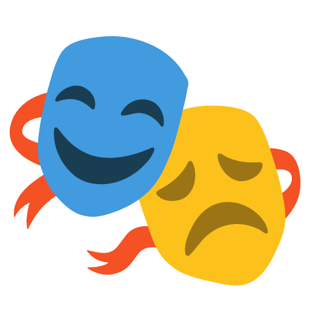

<p align="center"></p>

# Understudy

Your own actor portraits for Plex. Understudy stands in for Plex's image CDN, serves the photos you chose, and keeps them attached to the right people.

Under construction. The design is in [docs/design.md](docs/design.md).

## Development

### Requirements

- Go 1.26
- Node 24 and pnpm 11
- Docker, only to build the image

### Develop

One command runs both halves with hot reload: the binary is rebuilt and restarted on any Go change, and Vite serves the frontend with its own reload, proxying `/api` to the binary.

```bash
make dev
```

`make check` runs everything CI runs: gofmt, go vet, staticcheck, go test, prettier, eslint and svelte-check. `make lint` runs only the project's own rules: `web/eslint/` forbids raw form elements outside the ui library and palette colours anywhere, and `internal/lint/` keeps package imports on the right side of the design's seams. Each rule is one file with a test beside it.

### Preview

Build the binary with the frontend embedded and serve it the way the image does, at http://localhost:8090.

```bash
make build && ./bin/understudy edit
```

`docker build .` builds the image itself.

The masks are Google's Noto Color Emoji, used under the Apache License 2.0.
