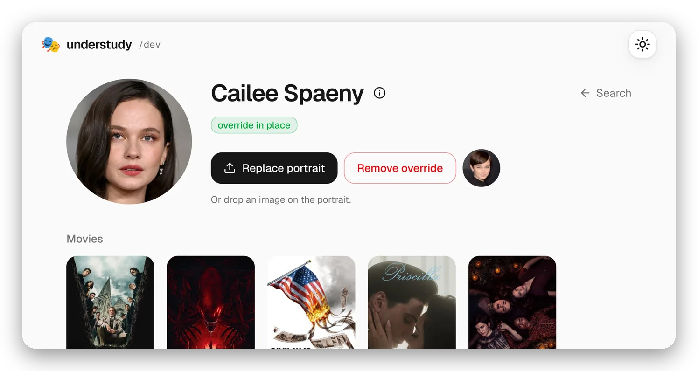

<p align="center">
  <picture>
    <source media="(prefers-color-scheme: dark)" srcset="docs/screenshots/header-dark.webp">
    
  </picture>
</p>

<p align="center"><b>Custom actor portraits for Plex.</b></p>

<p align="center">
  <a href="https://github.com/santiagosayshey/understudy/actions/workflows/ci.yml"></a>
  <a href="https://github.com/santiagosayshey/understudy/releases"></a>
  <a href="LICENSE"></a>
</p>

<p align="center">
  <picture>
    <source media="(prefers-color-scheme: dark)" srcset="docs/screenshots/hero-dark.webp">
    
  </picture>
</p>

## Overview

Understudy lets you replace Plex's actor portraits with pictures of your own by pretending to be Plex's metadata CDN. It is one small binary with three jobs:

- **proxy** answers as the CDN beside Plex, serving your portraits and forwarding the rest.
- **sync** asks Plex which URL it currently uses for each person you configured, since Plex names portraits by a hash that changes when its photo does, writes that down for the proxy, and clears Plex's photo cache when something changed.
- **edit** is a web page for choosing portraits: find the person, confirm it is the right one, crop, review, apply.

## Where it works

Understudy changes a portrait wherever Plex's server fetches it. A client that loads portraits from the CDN itself never touches the proxy and keeps showing Plex's picture. Checked so far:

| Client | Cast on a film or show |
| --- | --- |
| Plex Web | replaced |
| Plex for Windows | replaced |
| Plex HTPC | replaced |
| Apple TV | replaced |
| LG TV | replaced |
| iOS | not replaced; the app fetches the CDN itself |

The actor's own page uses a second, larger picture of the person that sync does not know about yet, so it shows Plex's picture in every client.

## Getting started

Plex fetches actor portraits itself, over HTTPS, from one hostname. Understudy answers at that hostname, so most of the setup is convincing Plex: a certificate it will trust, and a hosts entry that sends the hostname to the proxy. Nothing in Plex itself changes. With that in place you list people and their pictures in the configuration, and sync tells the proxy which URLs to answer with them.

### Requirements

- Docker with Compose
- Plex in Docker. This README assumes the linuxserver image.
- Your Plex [token](https://support.plex.tv/articles/204059436-finding-an-authentication-token-x-plex-token/)

### Compose

Everything runs from one compose file. The same file is at [contrib/compose.yml](contrib/compose.yml).

```yaml
# Understudy's files live in four directories:
#   certs/      the certificates and the Plex startup script, written by cert
#   config/     configuration.yml
#   portraits/  the pictures
#   state/      what sync works out for the proxy

services:
  # Answers as the CDN. Only Plex talks to it, at the fixed address below,
  # so it publishes no ports and needs no token.
  proxy:
    image: ghcr.io/santiagosayshey/understudy:latest
    command: proxy
    user: "1000:1000"
    volumes:
      - ./certs:/certs:ro
      - ./portraits:/portraits:ro
      - ./state:/state:ro
    networks:
      understudy:
        ipv4_address: 172.31.250.10
    restart: unless-stopped

  # Looks up each person's portrait URL in Plex, writes it to state/ for the
  # proxy, and clears Plex's photo cache when something changed. Runs on
  # start and then every hour, so `docker compose restart sync` runs it now.
  # Without --every it runs once and exits, for scripts and CI.
  sync:
    image: ghcr.io/santiagosayshey/understudy:latest
    command: sync --every 1h
    user: "1000:1000"
    environment:
      UNDERSTUDY_PLEX_URL: http://plex:32400   # Plex, as a container sees it
      UNDERSTUDY_PLEX_TOKEN: ${PLEX_TOKEN}
      UNDERSTUDY_PLEX_CACHE: /plex/PhotoTranscoder
    volumes:
      - ./config:/config:ro
      - ./portraits:/portraits:ro
      - ./state:/state
      - "/path/to/plex/config/Library/Application Support/Plex Media Server/Cache/PhotoTranscoder:/plex/PhotoTranscoder"
    restart: unless-stopped

  # Your Plex container, here or in its own compose file, with two additions.
  plex:
    image: lscr.io/linuxserver/plex:latest
    network_mode: host   # or attach it to the understudy network below
    # Resolves the CDN's hostname to the proxy, so Plex fetches portraits
    # from it. Only this one name is redirected. The address is the proxy's
    # ipv4_address above.
    extra_hosts:
      - "metadata-static.plex.tv:172.31.250.10"
    volumes:
      - /path/to/plex/config:/config
      # The startup script cert wrote. The linuxserver image runs it on every
      # start, so Plex trusts the proxy's certificate, upgrades included.
      - ./certs/plex:/custom-cont-init.d:ro

networks:
  understudy:
    ipam:
      config:
        - subnet: 172.31.250.0/24
```

### Certificates

Plex checks the CDN's certificate, so the proxy needs one for the CDN's hostname that Plex accepts. No public authority will sign that, so you make your own: a private authority, and a certificate signed by it. `cert` writes both into `certs`, along with the startup script that carries the authority into Plex.

```bash
docker run --rm --user 1000:1000 -v /path/to/understudy/certs:/certs ghcr.io/santiagosayshey/understudy:latest cert
```

> [!WARNING]
> `ca.key` is the authority's private key. Plex trusts the authority for every hostname, so anyone with the key can impersonate any site to Plex. Nothing needs it after `cert` runs. Keep it out of version control and with your other secrets.

### Configuration

The configuration is one YAML file, `config/configuration.yml`, listing people and their pictures:

```yaml
version: 1
people:
  - name: Cailee Spaeny                # as Plex spells it
    image: cailee-spaeny.jpg           # in the portraits folder
  - name: Anthony Edwards
    tagKey: 5d776825880197001ec9003b   # only when two people share a name
    image: anthony-edwards.jpg
```

- Names match Plex's spelling, ignoring case.
- `tagKey` is Plex's id for a person and tells apart two who share a name. The editor's Info dialog shows it.
- Images are JPEG or PNG. Square is what Plex's round avatars expect; anything else is centre-cropped.
- `understudy validate` checks the file against Plex without changing anything.

The file is plain YAML, so it can be version controlled and edited by hand. The editor makes that easier. It searches Plex for people, so names and ids come out right. It crops each picture to the square Plex expects, then writes the file and the portraits directory for you. Given a TMDb API key it also shows the portraits TMDb has of the person, so one can be picked and cropped without leaving the page. To use it, add it to the compose file:

```yaml
  # The editor, at http://localhost:8090. It writes configuration.yml and
  # the portraits directory.
  edit:
    image: ghcr.io/santiagosayshey/understudy:latest
    command: edit
    user: "1000:1000"
    environment:
      UNDERSTUDY_PLEX_URL: http://plex:32400   # Plex, as a container sees it
      UNDERSTUDY_PLEX_TOKEN: ${PLEX_TOKEN}
      UNDERSTUDY_TMDB_KEY: ${TMDB_KEY}         # optional, for portraits from TMDb
    volumes:
      - ./config:/config
      - ./portraits:/portraits
      - ./state:/state:ro
    ports:
      - 8090:8090
    restart: unless-stopped
```

```bash
docker compose up -d edit
```

Open http://localhost:8090. Search a name, open the person, drop in a photo or pick one of TMDb's, crop it, and apply from the review drawer.

### Environment

Everything is set with environment variables, or the flag of the same name.

| Name | Default | Description |
| --- | --- | --- |
| `UNDERSTUDY_PLEX_URL` | | Plex's address, as a container sees it. Needed by `edit`, `sync` and `validate`. |
| `UNDERSTUDY_PLEX_TOKEN` | | Plex's token. Needed by `edit`, `sync` and `validate`. |
| `UNDERSTUDY_PLEX_CACHE` | | Plex's `Cache/PhotoTranscoder` directory. `sync` clears it when something changed. |
| `UNDERSTUDY_EVERY` | | How often `sync` runs, such as `1h`. Without it, once. |
| `UNDERSTUDY_CONFIG` | `/config/configuration.yml` | The configuration file. |
| `UNDERSTUDY_PORTRAITS` | `/portraits` | The pictures the configuration refers to. |
| `UNDERSTUDY_STATE` | `/state` | Where `sync` writes what `proxy` serves. |
| `UNDERSTUDY_TMDB_KEY` | | A TMDb [API key](https://www.themoviedb.org/settings/api) or read access token. `edit` then offers TMDb's portraits on the actor page. Optional. |
| `UNDERSTUDY_CERTS` | `/certs` | Where `cert` writes the certificates and `proxy` reads them. |
| `UNDERSTUDY_LISTEN` | `:443` | The address `proxy` listens on. |
| `UNDERSTUDY_LISTEN` | `:8090` | The address `edit` listens on. |
| `UNDERSTUDY_CDN` | `https://metadata-static.plex.tv` | The real CDN `proxy` forwards misses to. |

## Commands

| Command | What it does |
| --- | --- |
| `understudy proxy` | Stand in for the CDN. Long-lived, beside Plex. |
| `understudy edit` | Serve the editor. Long-lived, wherever the browser is. |
| `understudy sync` | Resolve the configuration, write the state, clear Plex's cache. Once, or on an interval with `--every`. |
| `understudy validate` | Check the configuration against Plex. One shot. |
| `understudy cert` | Write the certificate authority, the proxy's certificate, and the Plex startup script. Once. |

`understudy <command> -h` lists each command's flags. They are the [environment variables](#environment) without the prefix.

## Development

### Requirements

- Go 1.26
- Node 24 and pnpm 11

### Develop

One command runs both halves with hot reload: the binary is rebuilt and restarted on any Go change, and Vite serves the frontend with its own reload, proxying `/api` to the binary. It works on a throwaway configuration under `dev/` and reads Plex through `UNDERSTUDY_PLEX_URL`.

```bash
make dev
```

`make check` runs everything CI runs. `make lint` runs only the project's own rules: `web/eslint/` forbids raw form elements outside the ui library and palette colours anywhere, and `internal/lint/` keeps package imports on the right side of the design's seams.

### Preview

Build the binary with the frontend embedded and serve it the way the image does.

```bash
make build && ./bin/understudy edit --plex-url http://your-plex:32400 --plex-token …
```

`docker build .` builds the image itself.

## Credits

- The masks are Google's [Noto Color Emoji](https://github.com/googlefonts/noto-emoji), Apache 2.0.
- The typeface is Vercel's [Geist](https://vercel.com/font), SIL Open Font License.
- Icons are [Lucide](https://lucide.dev), ISC.
- Face detection is [pigo](https://github.com/esimov/pigo), MIT.
- Understudy itself is [MIT](LICENSE).
