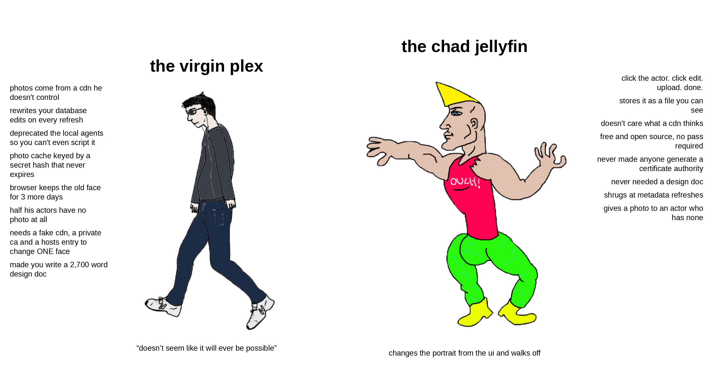
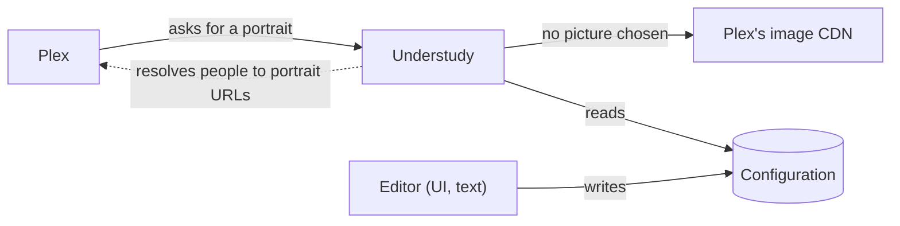

# Design Document

**tl;dr**



## Abstract

Plex draws actor portraits from its own CDN and offers no way to replace them. The database can be edited, but Plex overwrites the person's image URL on every metadata refresh, so nothing holds.

Understudy stands in for the CDN. The Plex container is pointed at Understudy under the CDN's hostname and given a certificate authority to trust, so every portrait Plex fetches passes through it. Where a picture has been chosen for that person, Understudy serves it; otherwise it forwards the request and returns the CDN's answer unchanged. Plex cannot tell the difference, nothing inside Plex changes, and removing the hosts entry and the certificate restores it exactly.

The difficulty is that Plex names a portrait by a content-hash URL, not by the person, and only Plex knows which URL is whose at any moment ([A.4](#a4-portrait-urls)). Understudy therefore keys its overrides on the person, asks Plex for each person's current URL, and asks again when Plex changes it. Plex's own image cache never expires ([A.2](#a2-server-cache)), so a changed override also needs that cache cleared once. The Plex behaviour this rests on is recorded in [Appendix A](#appendix-a-plex-behaviour).

## How it works



Plex asks Understudy for portraits, believing it is the CDN. When a picture has been chosen for that person, Understudy serves it from the configuration. Otherwise it forwards the request to the real CDN. The configuration consists of a YAML file that lists actors and their overriding portrait files. It can be edited by hand, or through Understudy's editor, which finds the actor in Plex, shows the current portrait so the right person is confirmed, and crops the upload to the square Plex expects, so that names, ids and image sizes come out right without hand work.

This breaks down into three core jobs:

1. Configuration
2. Overriding the CDN
3. Resolving people to URLs

## Configuration

### Storing

A user gives an actor a new portrait by doing two things: adding an entry to `configuration.yml` and placing the image file in the portraits directory.

The YAML file has a format version and a list of people. Each entry carries the actor's name and the relative path to an image file. Optionally it carries a tag key, Plex's own identifier for the person. A minimal file looks like this:

```yaml
version: 1 # format version
people:
  - name: Cailee Spaeny # actor name as Plex spells it
    image: cailee-spaeny.jpg # path relative to the portraits directory
  - name: Anthony Edwards # ambiguous name, so tagKey is needed
    image: anthony-edwards-er.jpg
    tagKey: 5d776825880197001ec9003b # Plex's 24-hex-digit person id
```

The name must match what Plex stores, compared case-insensitively. Plex's spelling is authoritative. A misspelled name does not silently fail: the resolving job reports the nearest match so the user can correct it. The image path may include subdirectories but must not escape the portraits directory. The file must be a JPEG or PNG that decodes successfully. A square image fits Plex's round avatars exactly. A non-square image is centre-cropped when served, so no image editor is needed to prepare it.

The tag key is required only when two different people share a name. When a name is ambiguous the resolving job lists every candidate along with the titles each appears in, so the user can copy the correct identifier. Two entries may never resolve to the same person. Every conflict or error is reported by the resolving job, never guessed around.

The reason the configuration is keyed on names rather than URLs is that Plex identifies a portrait by a content hash that changes whenever the upstream photo changes ([A.4](#a4-portrait-urls)). Names are stable and readable. The user writes a name and Understudy tracks the hash.

#### The editor

The user can write the YAML and manage images by hand in any text editor. Understudy also offers an optional editor, a web page that loads every actor Plex knows across all libraries. It shows each actor's current CDN portrait, name, identifiers, and titles so the correct person is confirmed before anything is uploaded. The user uploads an image of any size and positions it inside a fixed square frame. The frame outlines the round avatar and previews the result at the sizes Plex uses. On save the editor writes a 1,000 pixel square JPEG named from the actor's name and a matching YAML entry that includes both the name and the tag key. The editor reads from Plex and writes the file and the portraits directory. It does nothing else.

#### What the configuration is not

Understudy never writes the file or the portraits directory on its own. The resolving job tracks which URL each configured person currently has in a separate state file defined with that job. Because of that split both can be mounted read-only, committed to version control, and reviewed like any other change. Removing an entry or deleting its image withdraws the override at the next resolution.

### Validating

Validation checks a configuration against Plex without changing anything. It needs a Plex address and token and will not run without them. It confirms that the file parses and the version is known, that every entry has a name and an image, that image paths stay inside the portraits directory, that files exist and decode, and that images are square. It then asks Plex whether every name resolves to exactly one person and whether any two entries resolve to the same person. The output lists every entry with its outcome and the URL a resolved entry maps to. The exit status distinguishes a clean run, problems found, and could not complete, so it can gate a merge. The resolving job runs the same validation before it begins and stops on any error. The editor runs it on every save.

## Overriding the CDN

Plex fetches every portrait itself over HTTPS from a fixed hostname baked into its metadata ([A.1](#a1-fetching)). It resolves that hostname through the container's hosts file and verifies the server's certificate against its trust store. Neither the hostname nor the trust decision can be changed inside Plex, so overriding the CDN means answering as the CDN.

Understudy runs beside Plex as a server that presents a certificate for the CDN's hostname. Two changes are made to the Plex container: a hosts entry that resolves the CDN hostname to Understudy's address, and a private certificate authority added to the container's trust store by a startup script that survives image upgrades. Understudy's certificate is signed by that authority. Only the one hostname is redirected. Nothing in Plex's settings, libraries, or database changes, and removing the hosts entry and the certificate returns Plex to exactly what it was.

The authority's private key is a secret. Plex trusts it for every host, not only the CDN. The key is used once, to sign Understudy's certificate, and is kept with Plex's other secrets, never in version control.

### Request handling

Each request carries a path that identifies a portrait by content hash ([A.4](#a4-portrait-urls)). Understudy looks the path up in a table maintained by the resolving job. On a hit it serves the chosen image file, centre-cropping non-square images on the fly. On a miss it forwards the request to the real CDN, verifying the CDN's certificate normally, and returns the response unchanged. It accepts only GET and HEAD. Answering requests needs nothing from Plex, so this part holds no Plex credentials; asking Plex which path belongs to whom is the resolving job. Before the first resolution the table is empty, so every request passes through to the CDN. A fresh install fails open, not broken.

### Failure and caching

If Understudy is unreachable or Plex does not trust its certificate, the fetch fails and the client sees a 404 for that portrait only. Nothing else in Plex is affected. Plex does not cache the failure, so the next request after Understudy returns succeeds. In the other direction, serving a new image at an existing path does not change what Plex shows until its photo cache is cleared ([A.2](#a2-server-cache)) and the client fetches again ([A.3](#a3-client-cache)). Cache clearing is part of the resolving job, done once per batch of changes.

## Resolving people to URLs

The resolving job turns each configured name into the CDN path Plex currently uses for that actor. It writes its results to a state file that the overriding job reads. The state file records, for every configured actor, the resolved name, the tag key, the image path from the configuration, the current CDN path, when it was resolved, and a history of previous paths with the time each stopped being current. Entries that could not be resolved carry a problem description instead of a path. The file also records when the run happened and whether the cache was cleared. It is written whole and atomically, so a reader never sees a partial write. Because the state file is derived and machine-written it is kept apart from the configuration. Deleting it loses nothing: the next run recreates it.

### How a run works

A run begins by running validation exactly as described under Validating and stops on any error. It then fetches every actor Plex knows across its movie and show libraries. This listing is the only place a current portrait path exists, and it takes several seconds per library. Each configured entry is matched to one actor, by tag key where given, otherwise by name. The resolved path is compared with the previous state, and each image file's content hash with the one recorded, so a replaced picture under the same name counts as a change. The new state file is written. If any path changed, an image changed, or an entry was added or removed, Plex's photo cache is cleared once. A report is printed.

An entry that cannot be resolved on a run keeps its last known state and is reported as a problem. An entry that has never resolved has no path and is absent from what the overriding job matches. Once a name has resolved, the state keeps the tag key. If Plex later renames the actor, the run reports a problem rather than silently dropping the override.

### Drift and the cache clear

When Plex has changed an actor's portrait URL since the last run, the old path and the time are recorded in that entry's history. The new path becomes current. The overriding job follows the actor to the new URL. The image file is not touched and nothing else needs to happen. Until a run discovers the change, a drifted actor shows Plex's own picture, because the overriding job is still matching the old path.

The cache clear deletes the contents of Plex's photo cache directory, and refuses any directory not named `PhotoTranscoder` so a mistyped setting cannot empty something else. It happens at most once per run and only when something changed, after the state is written and a ten second pause for the proxy to load it, so nothing Plex fetches in between is cached again. It is cheap in practice because most of that cache is rebuilt locally from images Plex already has. Only remote images such as portraits are fetched again, and only when next viewed. Clients still hold their own copy for up to three days ([A.3](#a3-client-cache)).

### Scheduling and the report

The job runs once and exits, or, given an interval, on start and then on that interval until stopped. The interval is the longest a drifted portrait can show Plex's picture before the next run corrects it. A run that could not complete, because Plex was unreachable, is retried after a minute rather than the interval, since a deploy that recreates Plex and the job together makes the first run lose the race. A run that finds nothing changed is cheap and touches nothing.

The report lists every entry with its outcome, each drift as the old and new path, every problem, and whether the cache was cleared. The exit status uses the same three-way split as validation: clean, completed with problems, could not complete.

```json
{
  "ran": "2026-09-07T12:00:00Z",
  "cacheCleared": true,
  "entries": [
    {
      "name": "Cailee Spaeny",
      "tagKey": "5d7769e1fb0d55001f533216",
      "image": "cailee-spaeny.jpg",
      "imageHash": "7a10caf8…",
      "path": "/f/people/fe158d30be9278d335acd7a92037b20b.jpg",
      "resolved": "2026-09-07T12:00:00Z",
      "history": [
        {
          "path": "/f/people/0b2c…jpg",
          "until": "2026-09-01T06:00:00Z"
        }
      ]
    },
    {
      "name": "Cailey Spaeny",
      "problem": {
        "kind": "unknown",
        "detail": "no actor with that name; nearest: Cailee Spaeny"
      }
    }
  ]
}
```

## Implementation

Understudy is one Go binary and one container image. The three jobs and two helpers are its subcommands.

| Command | Job | Lifetime |
| --- | --- | --- |
| `understudy proxy` | Overriding the CDN | Long-lived, beside Plex |
| `understudy sync` | Resolving people to URLs | One shot, when invoked |
| `understudy validate` | Validating the configuration | One shot |
| `understudy edit` | The editor and its API | Long-lived, wherever the browser is |
| `understudy cert` | Writes the certificate authority and the leaf certificate | Once |

Each container runs one command. The proxy never holds the Plex token and never calls Plex's API. The editor never touches the certificates or the CDN port. They meet only at the configuration and the state file, which is what lets them run on different machines.

### Inputs

Every setting is a flag with an environment variable of the same name under `UNDERSTUDY_`.

| Flag | Default | Used by |
| --- | --- | --- |
| `--config FILE` | `/config/configuration.yml` | all |
| `--portraits DIR` | `/portraits` | all |
| `--state DIR` | `/state` | `proxy`, `sync`, `edit` |
| `--certs DIR` | `/certs` | `proxy`, `cert` |
| `--plex-url URL` | none | `sync`, `validate`, `edit` |
| `--plex-token TOKEN` | none | `sync`, `validate`, `edit`. Omitted when the URL is a proxy that injects it |
| `--plex-cache DIR` | none | `sync`. Plex's `Cache/PhotoTranscoder` directory. Without it no clear happens and the report says so. Any other directory name is refused |
| `--every DURATION` | none | `sync`. Run on start and then this often. Without it, once |
| `--cdn URL` | `https://metadata-static.plex.tv` | `proxy`. Changed only in tests |
| `--listen ADDR` | `:443` for `proxy`, `:8090` for `edit` | `proxy`, `edit` |
| `--status-listen ADDR` | `:8091` | `proxy`, a plain HTTP port for health and status |

### The proxy process

- Serves TLS on the listen address with the leaf certificate. HTTP/2 is on, which is what Plex speaks.
- Loads the state file at start and re-reads it when its modification time changes. Builds the map from CDN path to image file under the portraits directory.
- A hit serves the file with an ETag from its content hash. A non-square image is centre-cropped on first serve and the result kept in memory.
- A miss is forwarded to the CDN with the original path and the CDN's own hostname, over TLS verified against the system roots, and streamed back with its status.
- The status port answers `/healthz` and `/api/status` in plain HTTP, so a container health check needs no certificate.
- One log line per request: path, hit or miss, status, bytes, duration.

### The editor process

Serves the embedded page and a JSON API under `/api` on the listen address. It loads every actor from Plex once at start and keeps the listing in memory, since a listing takes several seconds per library.

Edits are staged, not written. Choosing a portrait uploads the file, the crop happens in a dialog, and "Stage" cuts the square on the server and holds it in memory with the entry it would produce. A removal is staged the same way. Staged changes appear in a review drawer, each with before and after portraits, and "Apply" writes them all to the configuration file and the portraits directory in one go. Nothing on disk changes before that. The file is rewritten from its parsed form, so hand-written comments do not survive an apply; entries and their order do.

| Method and path | Purpose |
| --- | --- |
| `GET /api/status` | Version, listing state, override count, pending change count |
| `GET /api/actors?q=` | Search the listing: the first 60 matches with key, name, path, libraries, override, staged and drift flags, and the total |
| `GET /api/actors/{key}` | One actor: name, path, person id, titles by library, the configuration entry with its state, and any staged change |
| `POST /api/actors/refresh` | Reload the listing from Plex |
| `GET /api/images/cdn?path=` | The CDN portrait, downsized |
| `GET /api/images/poster/{ratingKey}` | A title's poster, downsized |
| `GET /api/images/portrait?image=` | An image from the portraits directory |
| `POST /api/uploads` | Raw image body, up to 40 MB. Returns an id and the decoded dimensions |
| `GET /api/uploads/{id}` | The upload, for the crop canvas |
| `POST /api/changes` | Stage a change: key, kind `set` with an upload id and a crop box in source pixels, or kind `remove` |
| `GET /api/changes` | The staged changes, oldest first |
| `GET /api/changes/{key}/image` | A staged portrait |
| `DELETE /api/changes/{key}` | Discard a staged change |
| `POST /api/apply` | Write every staged change and forget them |

There is no endpoint that resolves or clears; the page shows a drift indicator from the state file and says to run the resolving job.

The page is a Svelte app: Vite, TypeScript, Tailwind, and the project's own ui library on a small set of semantic tokens, in light and dark. It is built to static files and embedded in the binary, so Node exists only at build time. The search page loads every actor once and filters locally. The actor page shows the portrait Plex will serve, Plex's own beside it once overridden, the titles by library, and the ids behind an info button. The crop editor is a fixed square canvas with pan and zoom, the crop clamped inside the image, a circle overlay for the round avatar, and previews drawn at the display's pixel ratio at the sizes Plex requests. The crop box goes to the server in source pixels and the server cuts the original. The editor opens on the face when the server finds one: pigo, a pure Go port of the pico detector with its cascade embedded in the binary, runs on the upload and the response carries a square centred on the largest face, 1.6 faces wide, which is how a set of hand-made crops framed people. A button returns to it after adjusting. No face found leaves the editor's usual guess. A title page shows a movie or show's poster and its whole cast as a grid of portraits that open each actor's page, reached from the posters on the actor page, so several people from one title are fixed from one place.

### Certificates

`understudy cert --out DIR` writes `ca.crt`, `ca.key`, `leaf.crt` and `leaf.key`: EC P-256, ten years, the leaf carrying the CDN hostname as its subject alternative name. It also writes `plex/10-understudy-ca.sh`, the Plex container's startup script with the authority embedded in it. It refuses to overwrite. The proxy reads the leaf pair, the Plex container mounts `plex/`, and `ca.key` is not needed again.

## Deploying

### The Plex container

Two additions and a normal recreate:

1. `extra_hosts` mapping the CDN hostname to the proxy's address. Only that name is redirected. It works under host networking, which is how Plex is usually run.
2. The `plex/` directory `cert` wrote, mounted at `/custom-cont-init.d`. The linuxserver image runs whatever is there on every start; the script writes the embedded authority into `/usr/local/share/ca-certificates` and runs `update-ca-certificates`, so image upgrades keep the trust.

The proxy needs a fixed address the Plex container can reach on port 443. On Docker that is `ipv4_address` on a user-defined bridge network, which a host-networked Plex reaches through the bridge. Verified on Docker under WSL2. Not yet verified on Unraid, where one `curl` from the host to that address settles it.

### All in one

Three services from one image, the resolving job on an interval, and a Plex service with the two additions.

```yaml
services:
  proxy:
    image: ghcr.io/santiagosayshey/understudy:latest
    command: proxy
    user: "1000:1000"   # the owner of certs/, so leaf.key (0600) is readable by the non-root image
    volumes:
      - ./config:/config:ro
      - ./portraits:/portraits:ro
      - ./certs:/certs:ro
      - ./state:/state
    networks:
      understudy:
        ipv4_address: 172.31.250.10
  edit:
    image: ghcr.io/santiagosayshey/understudy:latest
    command: edit
    environment:
      UNDERSTUDY_PLEX_URL: http://localhost:32400
      UNDERSTUDY_PLEX_TOKEN: ${PLEX_TOKEN}
    volumes:
      - ./config:/config
      - ./portraits:/portraits
      - ./state:/state:ro
    ports:
      - "127.0.0.1:8090:8090"
  sync:
    image: ghcr.io/santiagosayshey/understudy:latest
    command: sync --every 1h
    environment:
      UNDERSTUDY_PLEX_URL: http://localhost:32400
      UNDERSTUDY_PLEX_TOKEN: ${PLEX_TOKEN}
      UNDERSTUDY_PLEX_CACHE: /plex/PhotoTranscoder
    volumes:
      - ./config:/config:ro
      - ./portraits:/portraits:ro
      - ./state:/state
      - /path/to/plex/Cache/PhotoTranscoder:/plex/PhotoTranscoder
  plex:
    extra_hosts:
      - "metadata-static.plex.tv:172.31.250.10"
    volumes:
      - ./certs/plex:/custom-cont-init.d:ro
networks:
  understudy:
    ipam:
      config:
        - subnet: 172.31.250.0/24
```

Without `--every` the job runs once and exits, for scripts.

### Split

The editor on a workstation, the proxy and the resolving job on the server, the configuration in version control between them.

- On the workstation, `understudy edit` edits the configuration file and portraits directory inside a checkout of the repository. Applying a change is a commit and a merge.
- On the server, `understudy proxy` in the Plex stack with the configuration mounted read-only from the checkout and state in appdata.
- `understudy sync` as a pipeline job: after every deploy that touched the configuration, and on a schedule. `understudy validate` runs in the pull request check, so a misspelled name fails the check rather than the deploy.

## Security

- The editor has no authentication. It binds to localhost on a workstation and sits behind the reverse proxy and its authentication on a server.
- Plex trusts the certificate authority for every host. `ca.key` lives with Plex's other secrets and is never committed.
- Image paths in the configuration and in API requests must stay inside the portraits directory. Anything that escapes is rejected.
- Uploads are capped at 40 MB and decoded with a limit on pixel count.
- The proxy verifies the real CDN's certificate. Passthrough traffic is not weakened.
- The worst case is a visible 404 on actor portraits. Nothing else in Plex is affected.

## Not in scope

- Actors Plex has no photo for. Nothing is ever requested for them, so there is nothing to override.
- Posters, backgrounds and other CDN assets. The mechanism would serve them; the tool does not.
- Native Plex apps' own image caches. Their retention is unknown.
- Clearing only the changed actor's cache entries. Not possible without the hash recipe. One clear per run is cheap because most of that cache is rebuilt locally.

## Engineering

```
cmd/understudy/      main, subcommand dispatch, flags
internal/plex/       API client: sections, actor listings, item metadata; a fake server for tests
internal/config/     configuration file and portraits directory: parse, validate
internal/resolve/    names and tag keys to current paths; drift diff; the report
internal/state/      state file: read, write atomically, watch
internal/proxy/      TLS listener, map, passthrough, centre-crop
internal/crop/       decode, crop, square, encode
internal/api/        HTTP handlers for the editor
internal/certs/      certificate generation
web/                 Svelte app: Vite, TypeScript, Tailwind; the ui library under src/lib/ui
embed.go             embeds web/dist
contrib/             compose examples
docs/                this document and the user docs
```

Conventions:

- `develop` is the only long-lived branch. Pull requests target it. Every push to it builds `:develop` and a short-sha tag. A version tag builds `:x.y.z`, `:x.y` and `:latest`, with the changelog from git-cliff. Conventional Commit titles, enforced in CI.
- Go: `gofmt`, `go vet`, `staticcheck` pinned. Frontend: prettier with the Svelte and Tailwind plugins, eslint with the Svelte plugin, `svelte-check`. One script runs all of it, locally and in CI.
- Tests: Go table tests per package. Plex is a recorded fake behind `httptest`. The proxy is tested in-process end to end with a throwaway authority. Vitest for the crop maths. No browser automation.
- Renovate weekly with a seven day minimum age, routine updates grouped, semantic chore commits, covering Go modules, the pnpm lockfile and the toolchain images in the Dockerfile.
- `.editorconfig` for every file type, with prettier set to agree with it.

## Milestones

Each is one or two pull requests and ends with something that runs.

1. **Bootstrap.** Branch, Go module, web scaffold, editorconfig, lint and format script, CI, Renovate, Dockerfile, release workflow. Done when a push to `develop` produces an image that serves a placeholder page.
2. **Configuration and resolving.** Plex client with its fake, configuration loader, resolver, state file, drift diff, `validate` and `sync`. Done when `sync` writes a correct state file from the real library and `validate` reports a misspelled and an ambiguous name.
3. **Proxy.** `cert` and `proxy`, the TLS listener, the map with reload, verified passthrough, centre-crop, the status port. Done when the lab Plex container fetches an override through the proxy and passes everything else through.
4. **Cache clear and Plex hook.** `sync` clears the photo cache when the map changed, the Plex hook, the compose examples. Done when a change made on disk shows in the lab Plex after one `sync` and one hard refresh.
5. **Editor.** `edit`: the API, the actor grid, the actor page, upload and crop, save and remove, the drift indicator. Done when a portrait chosen on a workstation lands in the configuration as a 1000 pixel square with a correct entry.
6. **Docs and release.** README and CONTRIBUTING, the compose examples and the Plex hook documented. Done when the first version tag exists and a server serves a portrait from the tagged image.

## Appendix A: Plex behaviour

The behaviour the design relies on, verified on Plex Media Server 1.43.3.

### A.1 Fetching

Clients never fetch the CDN. The server's photo transcoder downloads the image over HTTPS, honours the container's hosts file, and verifies the certificate against its bundled roots and the system store.

### A.2 Server cache

The transcoder caches the original and every resized copy under `Cache/PhotoTranscoder`, keyed by an opaque hash, with no expiry. A changed override stays invisible until the whole directory is cleared.

### A.3 Client cache

Clients receive a three day `max-age`, so browsers hold a portrait for up to three days unless hard refreshed.

### A.4 Portrait URLs

A person's URL is a content hash that changes when their photo changes upstream. The CDN is a plain file server built for caching: a path returns the same bytes forever, so a new photo gets a new path. The person-to-path mapping lives in Plex's metadata service and is copied into the server's database on refresh. Nothing between the server and the CDN can know whose picture a path is without asking Plex.

### A.5 The actor listing is only the top billed

A library's actor listing holds only people billed in the top three of at least one title in it. Everyone else is in the cast lists but not the listing, so a name lookup against the listing misses them. Plex's search with the people type finds them, with the tag id, person id and portrait URL, and that is the fallback everywhere a name or a tag id has to be turned into a person.

### A.6 Which clients ask the server

Plex Web, Plex for Windows, Plex HTPC, and the Apple TV and LG TV apps ask the server for cast portraits, so the override reaches them. The iOS app takes the CDN address from the item's metadata and fetches it itself, so nothing on the server can change what it shows. The actor's own page, in every client, uses a second and larger picture of the person from a different URL, which the resolving job does not know.

## Appendix B: Measurements

Numbers the decisions rest on, taken on 2026-09-07 on a workstation and on a home server running Plex.

### B.1 Idle memory

| Runtime | Idle memory |
| --- | --- |
| A small Go server in a distroless container | 5.5 MB |
| SvelteKit on adapter-node, hello world after one request | 60 MB |
| Node with sharp loaded, doing nothing | 62 MB |
| Python prototype holding image caches in memory | 229 MB |

### B.2 Plex's photo cache on a home server

| Measure | Value |
| --- | --- |
| Size | 6.1 GB |
| Files | 209,996 |
| Written in the previous 7 days | 60,829 |

### B.3 Actor listings

About 8 seconds per library section, four sections, 3,950 distinct people. 3 of 3,947 distinct names are shared by more than one person.

### B.4 Portrait sizes requested by Plex Web

360 by 360 for the cast strip, with occasional 240 by 120 and 480 by 480 requests. CDN originals are 2195 by 2195.
